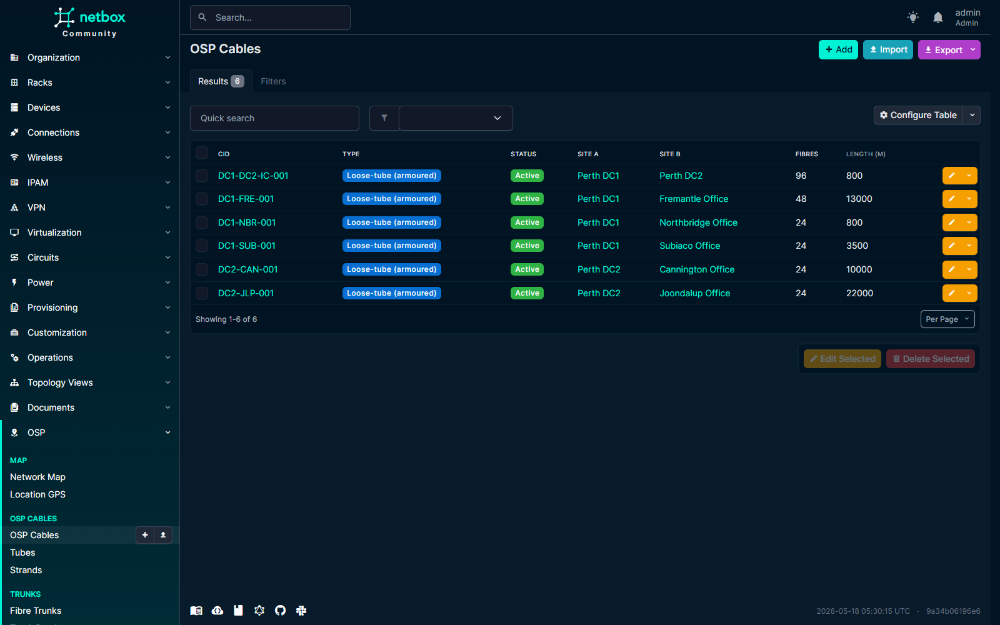
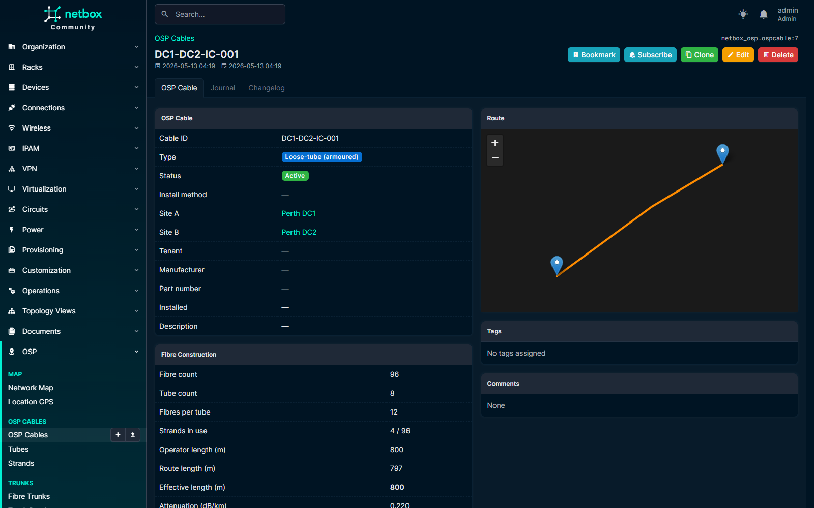
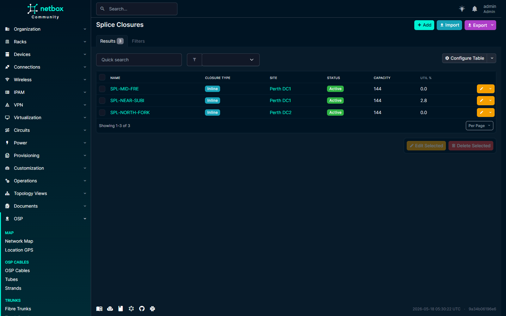
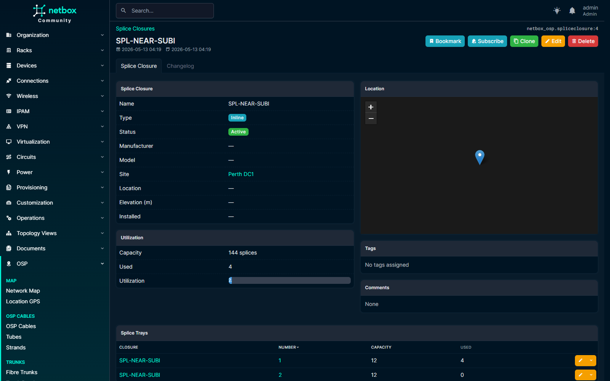
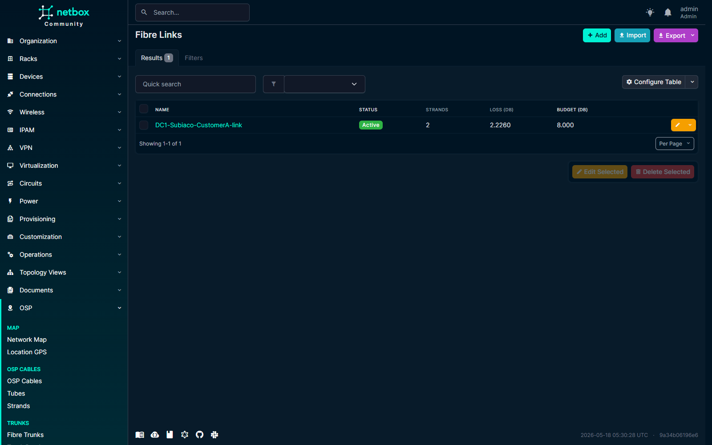
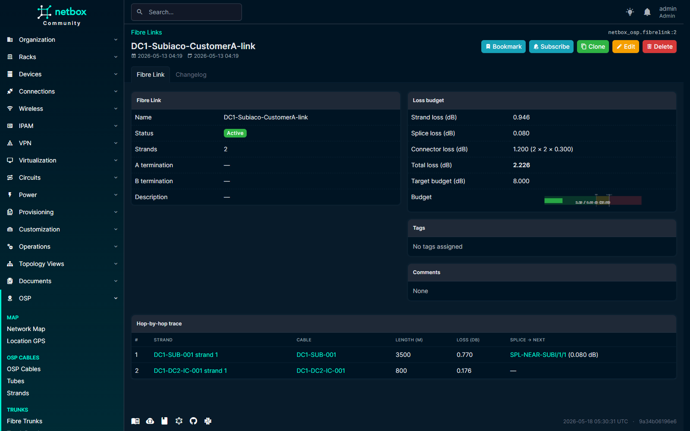
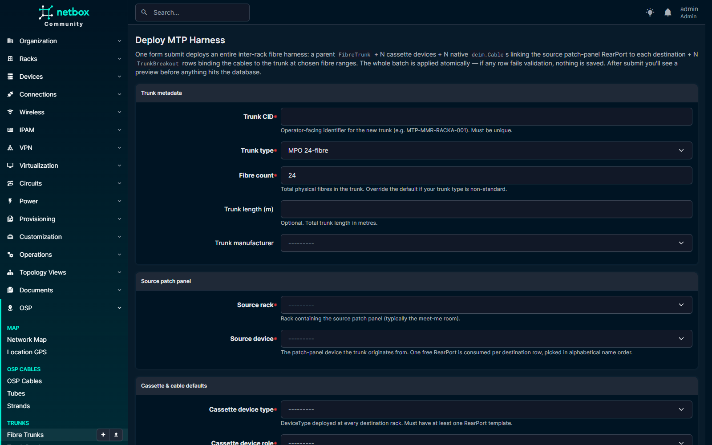
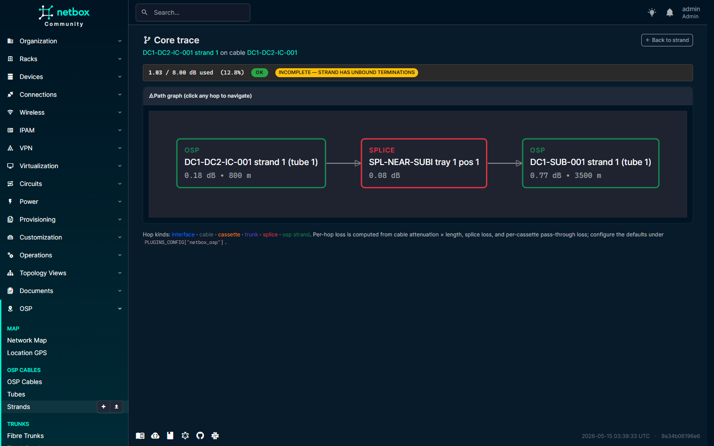
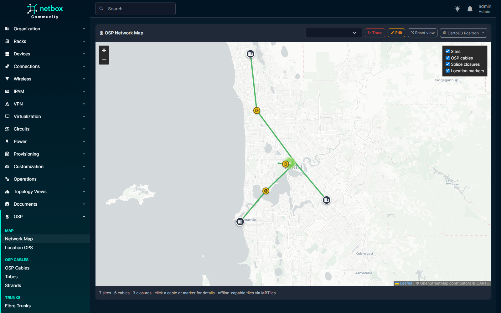

# Demo walkthrough

A guided tour of `netbox-osp` running against the live demo at
`http://192.168.1.137:8000/` (a small Perth-metro topology — 7 sites,
6 OSP cables, 3 splice closures, 1 fibre link). Same plugin you get
from `pip install netbox-osp`, same NetBox 4.6 you already run.

## 1. Why this plugin exists

NetBox handles inside-plant cabling beautifully. The moment you push
outside the building, gaps appear:

- multi-tube armoured OSP cables with TIA-598-C buffer-tube colour codes
- splice closures in pits with measured per-strand loss in dB
- MPO/MTP trunks fanning out to LC cassettes across racks
- end-to-end fibre links where you actually need to **know** whether
  the loss budget closes

`netbox-osp` is the plugin that fills those gaps — without requiring
PostGIS, and without replacing anything NetBox core already does well.

## 2. Model the plant

OSP cables sit at the top of the model: site-to-site spans with type,
fibre count, attenuation per km, GeoJSON route, and an internal
arithmetic invariant (`fibre_count == tube_count × fibres_per_tube`
enforced in `clean()`).



Drill into any cable and you see the buffer tubes, individual strands,
attenuation, length, and the same plant-boundary validation that
catches operator slips when re-routing on the map.



## 3. Plan your splices

Splice closures sit at sites with optional GeoJSON points (mini-map on
the detail page), a capacity_splices count, and child trays that hold
individual splices. Each splice records the joined strands plus
measured loss in dB.



The closure detail shows utilisation against capacity, the location on
its own Leaflet mini-map, and the per-tray rollup.



## 4. Compute the loss budget

Fibre links chain N strands through M splices into an end-to-end
logical link, with a configurable `target_loss_budget_db`. The plugin
computes strand attenuation × length + per-splice loss + per-connector
loss, and bands the total against your budget.



The link detail page shows the breakdown — strand loss, splice loss,
connector loss, total dB used — plus an SVG gauge that turns yellow
at 80 % and red at 100 % of target. The Hop-by-hop trace at the
bottom of the page walks every contributor.



## 5. Deploy MTP harnesses in one click

NetBox today can't natively express "one 24F MTP trunk → 12F breakout
to rack A + 12F to rack B" as a single physical entity. `netbox-osp`
adds `FibreTrunk` + `TrunkBreakout` that bridge to NetBox's native
`dcim.Cable`, and ships a one-click deploy form that atomically
creates:

- the parent `FibreTrunk` row
- N cassette `dcim.Device`s (auto-instantiated from a cassette
  device-type template — the plugin ships five of those too)
- N `dcim.Cable`s connecting the source patch-panel rear ports to each
  destination cassette
- N `TrunkBreakout` rows binding each child cable to the trunk at the
  chosen fibre range

Operator fills one form, confirms a preview, commits. Replaces ~30
individual object writes with one transaction.



## 6. Trace any core, end to end

Pick any strand on any cable, any FrontPort, or any device Interface,
click **"Trace this core"**, and the plugin walks the path: cable
terminations into NetBox's `dcim.Cable.trace()`, then jumps the splice
graph in OSP-land, then back through more dcim terminations until it
hits a device interface on the other side.

Every hop renders with its kind (interface, cable, cassette pass-
through, trunk fibre, splice, OSP strand), its per-hop loss, and a
clickable link to the underlying object. The summary band above the
graph shows total dB used against the link's target, colour-coded.



The graph is rendered with dagre-d3 and ships fully vendored — no CDN
dependency, no online tile servers, no PostGIS.

## 7. See the whole plant on the map

The full-screen plant map at `/plugins/osp/map/` ties everything
together: sites, OSP cable routes (drag-to-edit with leaflet-geoman),
splice closures clustered at the right zoom level, and an optional
overlay of per-Location GPS markers.

The base-layer switcher (top-right) cycles seven public providers
(OSM, HOT OSM, CartoDB Positron + Dark Matter, OpenTopoMap, CyclOSM,
Esri World Imagery) plus a bundled offline MBTiles bundle. After
three tile errors in five seconds, the map auto-falls-back to offline
— so the OT operator on an air-gapped network gets a working plant
view without changing a setting.



## 8. Install

```bash
pip install netbox-osp
```

Then enable the plugin in `configuration/plugins.py`:

```python
PLUGINS = ["netbox_osp"]
```

and run:

```bash
python manage.py migrate
python manage.py collectstatic --no-input
python manage.py load_osp_cassettes   # optional — seeds 5 MPO/MTP cassettes
```

NetBox 4.6.x, Python 3.12 / 3.13, Postgres 17, Redis 7. **PostGIS not
required.** Apache-2.0 licensed.

- **Repo**: <https://github.com/iamjohnnymac/netbox-osp>
- **PyPI**: <https://pypi.org/project/netbox-osp/>
- **Configure**: [Configuration reference](configure.md)
- **Data model**: [ER overview](data-model.md)
- **Core tracer details**: [How it walks the path](core-tracer.md)
- **Compatibility**: [Per-release support matrix](compatibility.md)
